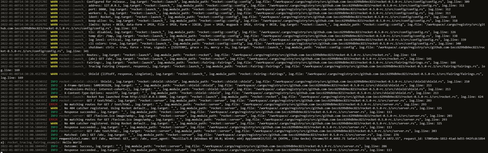
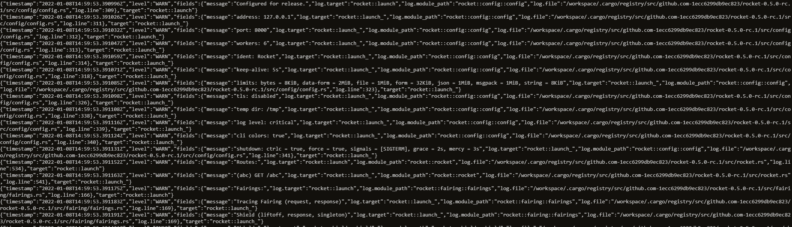

# Rocket Tracing Fairing Example

This repository aims to give a short example of how you can add a Fairing to your Rocket for tracing and how to use it in requests.
> As Rocket currently doesn't implement this by default many have asked about implementing this. The actix-web tracing crate has been taken as a reference for the info span data

## Logging

There 2 log types and 5 log levels you can configure at runtime.

### Log Types

Log types control how your output is formatted. They can be controlled via the environment variable `LOG_TYPE`.

The 2 types are:
- `formatted`(default): a good choice for development

- `json`: the propert choice if you are running your app in a production environment. If you are using [`vector`](https://vector.dev) you can check out `parse_json(...)`

### Log Levels

A lot of that code originated from a stable PR in rocket's repository [SergioBenites/Rocket#1579](https://github.com/SergioBenitez/Rocket/pull/1579) so thanks a lot to the people there and @jebrosen for the awesome work.

You can controll these with the environment variable `LOG_LEVEL`:
- `critical`: Shows only critical logs
- `support`: Shows logs to help out
- `normal`: Includes all your default logs
- `debug`: Shows debuging with tracing 
- `off`: Shows exactly nothing

## Request-Tracing

You need to add the `enter` and `drop` statements inside your request as Rocket will not enter the span by default as it is currently not implemented in the base repository.

### Names

If your parser follows the opentelemetry spec it will pick up the `otel.name` field as the name of the span which is a composit of the uri path and the method

### Request Ids

You may be hosting rocket on a platform which provides it's own request ids via the `X-Request-Id` standard. If so rocket will pick this up and add it to the request span.

If not rocket will create a uuid, use that and append it as the `X-Request-Id` header to the response.

### Why isn't this a crate?

As of right now I have has 4 people asking me the same question about tracing and rocket from difference perspektives within 4 days. If more people point out their desire to have a crate for this please open an issue and let the people vote.